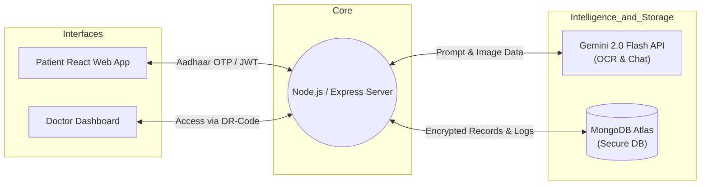
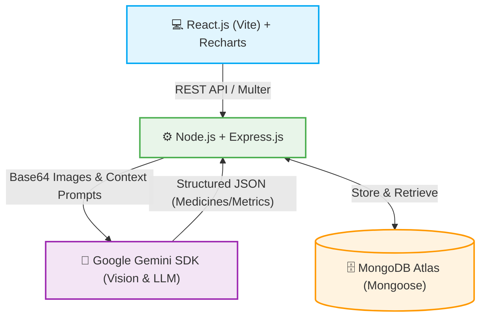

# HealthVault AI - Complete Pitch Deck Contents

Based on the Smart India Hackathon template format, here is the complete set of slides for your pitch deck updated for the final implementation.

---

## Slide 1: Title Slide
* **Project Title:** HealthVault AI
* **Tagline:** Your Health. Your Data. Your Control.
* **Domain:** Healthcare & AI
* **Hackathon:** Pragyantra 2026 | PES Modern College of Engineering

---

## Slide 2: Problem Statement
* **Fragmented Health Data:** Patient medical records are scattered across various hospitals, independent clinics, and diagnostics labs.
* **Lack of Data Ownership:** Patients have zero control over who views their data, creating massive privacy risks.
* **Medicine Non-Adherence:** Patients forget daily dosages or misplace prescriptions, leading to prolonged illnesses.
* **Absence of Actionable Insights:** Dense medical reports are difficult to understand, leaving patients without early disease warnings.
* **Real-World Impact:** Redundant medical tests, fatal delays during emergencies, and poor continuity of treatment.

---

## Slide 3: Proposed Solution & Core Features
*(Format: Bullet points on left, Architecture diagram on right)*

**1. Patient-Centric Identity & Security:**
*   **Aadhaar-OTP Login:** Frictionless registration and authentication.
*   **Emergency QR Code:** Instantly displays blood group, allergies, and *active* medications for first responders securely.
*   **Family Vault:** Manage records for aging parents & children without smartphones.

**2. AI-Driven Automation (Gemini 2.0 Flash):**
*   **AI Prescription OCR:** Upload reports/prescriptions; AI extracts metrics, diagnoses, and *auto-imports* medicines into a Smart Batch Scheduler.
*   **Multilingual AI Assistant:** Context-aware chat (English/Hindi/Marathi) acting as a personal health guide based on the user's data.
*   **Health Trust Score:** A dynamic 0-1000 score based on real-time health data analysis, useful for insurance premium discounts.

**3. Doctor Access Control System:**
*   **Unique Doctor Identifiers (DR-XXXX):** Doctors get specific codes for rapid, search-based access granting by patients.

**(Architecture Diagram - Right Side)**

---

## Slide 4: Technical Approach
*(Format: Diagram on Top/Middle, Tech Stack box on bottom)*

**Tech Stack Breakdown:**
*   **Frontend:** React.js (Vite), React Router, Context API, Recharts (for health trends).
*   **Backend:** Node.js, Express.js.
*   **Database:** MongoDB Atlas (Mongoose schema validation).
*   **Security:** JSON Web Tokens (JWT), Bcrypt password hashing, Simulated Aadhaar OTP.
*   **AI Engine:** Google Gemini 2.0 Flash API for visual OCR data extraction, comprehensive health analysis, and conversational AI.

---

## Slide 5: Feasibility, Scalability and Viability
*(Format: Points on Top, Challenges table on Bottom)*

**Feasibility Analysis**
*   **Tech:** Built on the robust MERN stack with serverless AI APIs, making it highly portable and deployable.
*   **Business/Monetization:** B2B integration with Insurance firms utilizing the AI "Health Trust Score" for risk-adjusted data.
*   **Ops:** Clean, gamified UI and Aadhaar-based entry lowers the barrier for nationwide adoption.

**Challenges vs Solutions**

| Challenges | Solution |
| :--- | :--- |
| **Elderly & Rural UX Complexity** | **Frictionless Login:** Aadhaar OTP entry. Multilingual AI Assistant understands local languages. |
| **Manual Data Entry Friction** | **Automated OCR:** AI automatically batch-imports medicine schedules and lab metrics from uploaded photos. |
| **Doctor Discovery & Consent** | **DR-XXXX Code System:** Patients simply search a 4-digit code to grant rapid, targeted access to doctors. |

---

## Slide 6: Example Workflows (Pitch Highlights)
*   **The Seamless Onboarding:** A user enters their Aadhaar number, verifies the OTP, and their account is instantly created with a unique Health ID.
*   **Automated Medicine Tracking:** A patient snaps a photo of a messy prescription. Gemini AI reads it, identifies *Montelukast 10mg* and *Cetirizine*, and automatically adds them to the daily schedule with reminder alerts.
*   **Emergency Lifesaver:** A first responder scans the lock-screen QR code on an unconscious patient. They instantly see the patient is O+, allergic to Penicillin, and currently taking blood thinners.
*   **The AI Doctor Console:** The patient runs an AI Analysis. The app scans 6 months of lab reports, sees a dropped cholesterol level, upgrades their Health Trust Score to 850, and triggers a 15% insurance discount.
